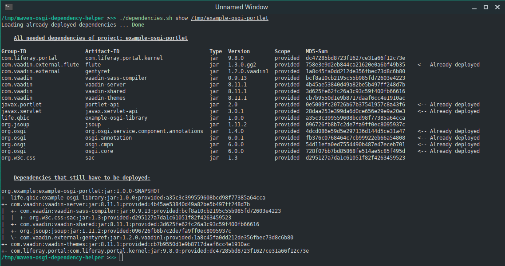

# Maven OSGi Dependency Helper

This project contains a bash script that can be used by a small group to better keep track of which dependencies of their current OSGi project(s) are already deployed in the framework.

**Note:** This tool does not deploy dependencies in your OSGi framework!

## Prerequisites

* Maven 3+
* Ordinary Bash Shell
* File on remote server
* SSH user that is able to modify the file

## Configuration

Before use for the first time the appropriate parameters must be set in the configuration file:
* **local_file_path:** Local path to file with deployed dependencies
* **remote_file_path:** Path on remote server to file with deployed dependencies
* **ssh_key:** File name of the SSH key
* **ssh_user:** Username of the SSH user
* **ssh_host:** IP address/Hostname of the remote server with the deployed dependencies file

## How to use

1. Clone the project locally with `git clone https://github.com/das-Abroxas/maven-osgi-dependency-helper` or just download the script and configuration file.

2. Make the script executable `sudo chmod +x dependencies.sh`

**Optional**: Since the password of the SSH key is requested every time the _ssh_ or _scp_ command is called it is advisable to store the SSH key+password in an SSH agent. This way the tool can be used without interruptions.

An introduction and/or further reading about _ssh-agent_ can be found for example on [ssh.com](https://www.ssh.com/ssh/agent) or [Wikipedia](https://en.wikipedia.org/wiki/Ssh-agent).

### Show dependencies

`./dependencies.sh show /path/to/maven-project/1 /path/to/maven-project/2 ...`

With the **_show_** command you get an overview over all transitive dependencies of your local project(s).

First you get a table where all dependencies are listed and those already used in the framework are marked additionally.

Second you get a tree view of the dependencies that are not yet deployed in the framework, so you can orientate yourself which dependency is most useful next.

### Add dependencies

`./dependencies.sh add Maven:Dependency:String:1.0.0:MD5Sum Maven:Dependency:String:2.0.0:MD5Sum ...`

With the **_add_** command you add the specified dependencies to the remote file that holds the already deployed dependencies.

### Remove dependencies

`./dependencies.sh remove Maven:Dependency:String:1.0.0:MD5Sum Maven:Dependency:String:2.0.0:MD5Sum ...`

With the **_remove_** command you remove the specified dependencies from the remote file that holds the already deployed dependencies.
